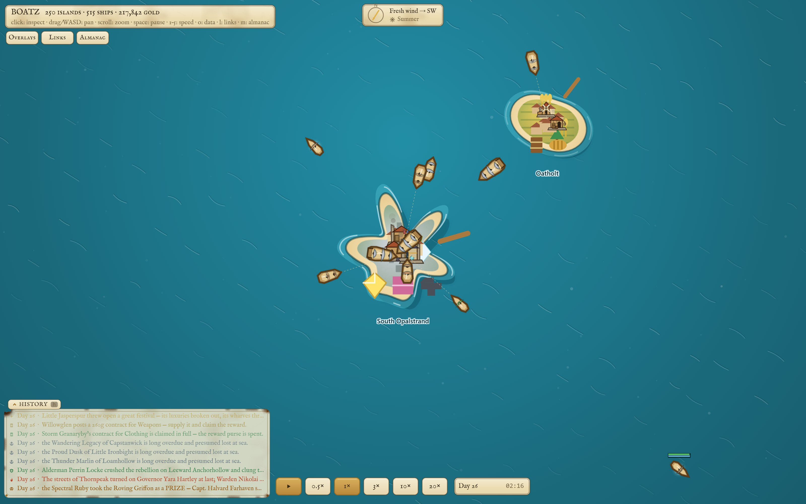
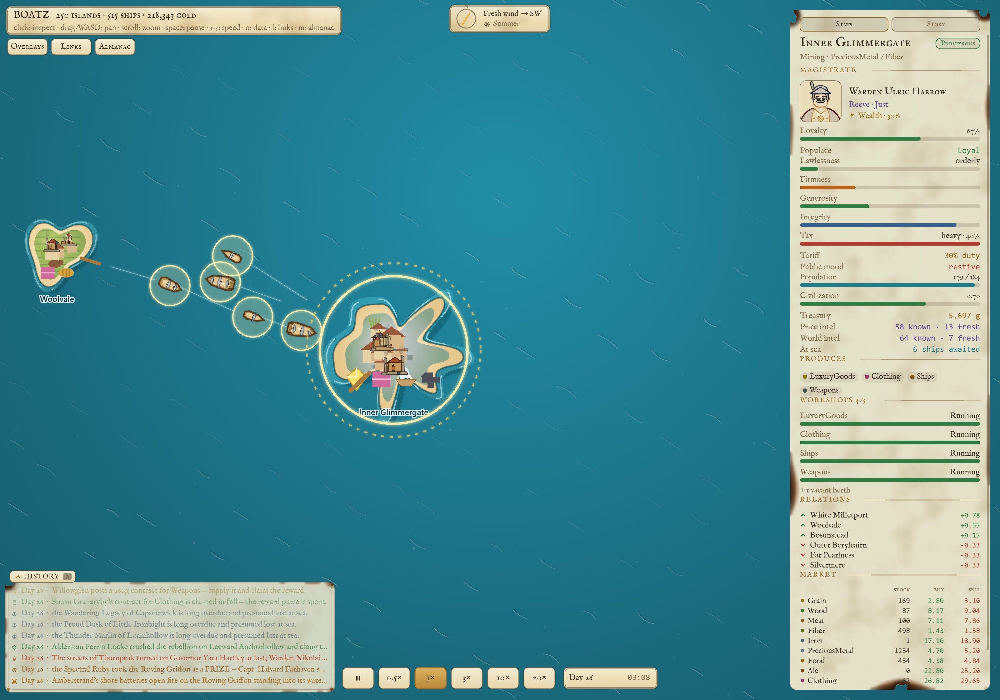
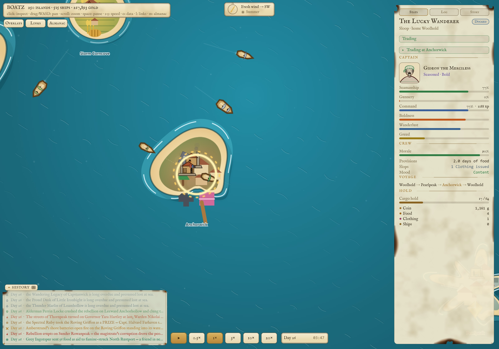
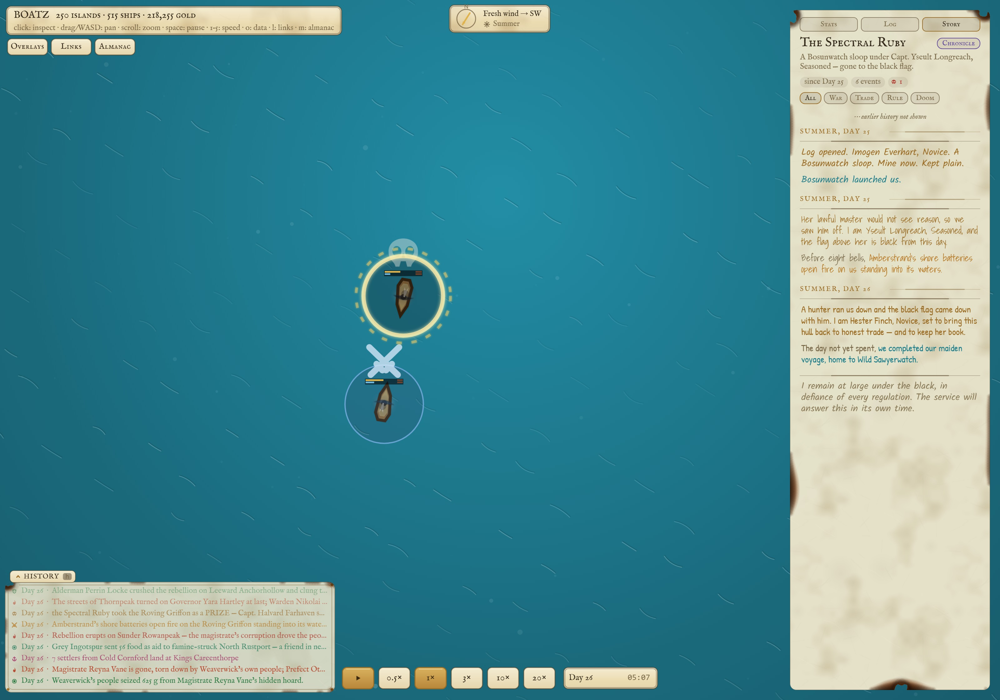
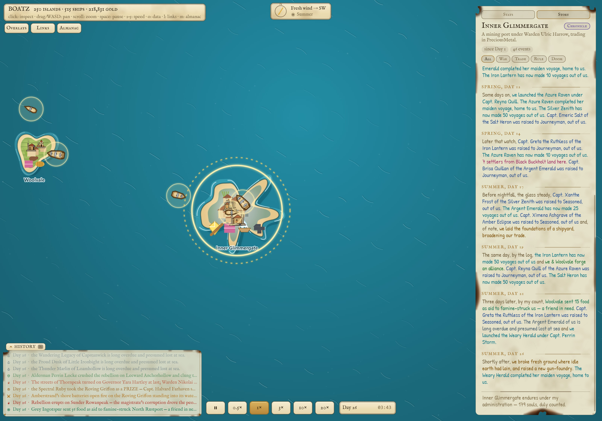
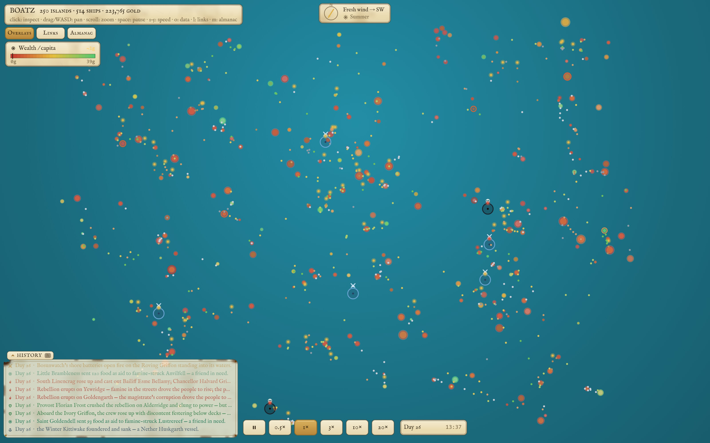
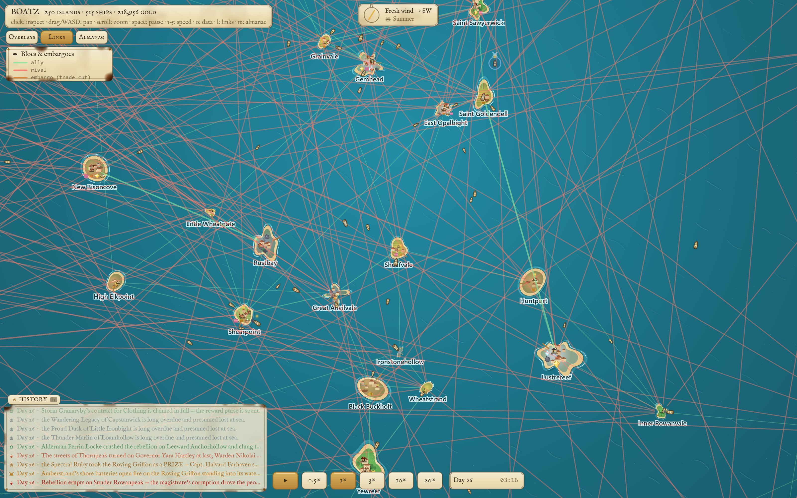
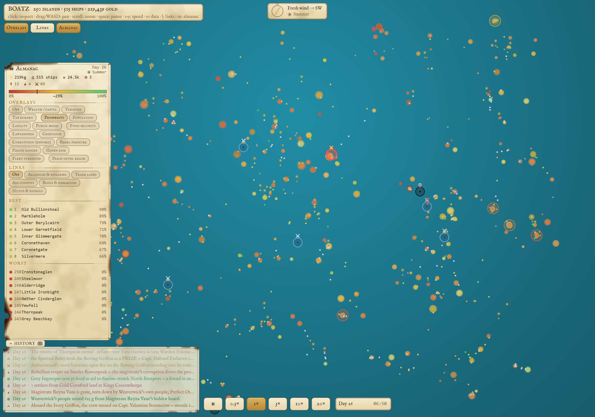
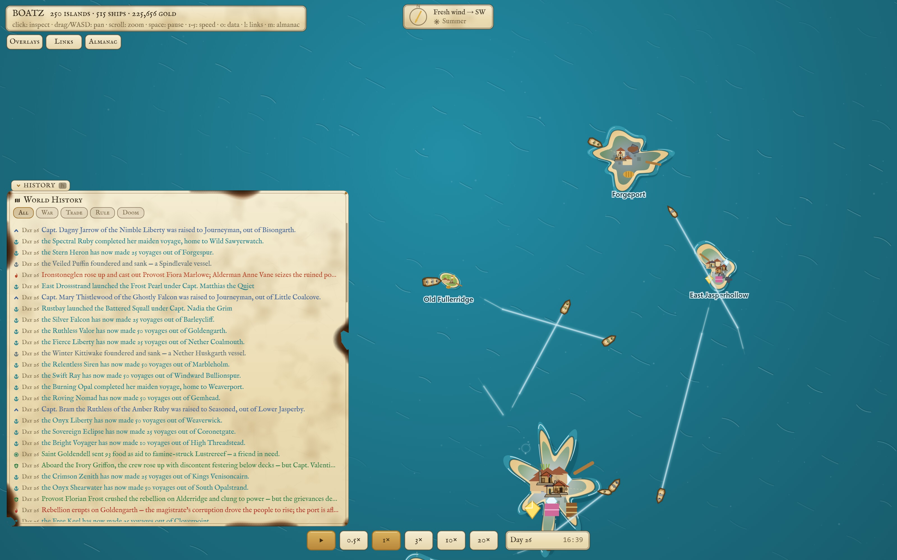

# BOATZ

*A deep economic simulation of a pirate-age archipelago. Hundreds of islands, ships, captains and
crews, all running on their own decisions, in a browser, with no build step.*



> Hi, I'm Pat. This started as an idea for an online Sid Meier's Pirates style game. Before
> building any of the game part, I wanted a world that was actually worth sailing around in:
> ports that live or die by their own decisions, and pirates who exist because the economy
> made them. I never did get to the gameplay. I have been having far too much fun adding
> layers to the simulation instead, and it keeps growing.

BOATZ is a living archipelago economy that runs in a browser. A few hundred islands farm, mine,
manufacture, price their goods, and send named captains out to trade. Nothing in it is scripted.
Famines, boom towns, trade blocs, embargoes, mutinies, rebellions, piracy, and the naval response
to piracy are all downstream of ordinary actors making local decisions with bad information.

There is no player yet. What exists is the world, a nautical chart to watch it on, and a written
history of everything that has ever happened in it.

If you want to run it right now: `npm install && npm start`, then open <http://localhost:6970>.
Prerequisites, configuration and the headless runners are in [Run it](#run-it) further down.

## What you are looking at

Click any island or ship and the chart tells you everything it knows about it. Every screenshot in
this README is the same sea (seed 11) on day 25 of its life.



**A port.** Warden Ulric Harrow, a Reeve with a taste for Wealth, ruling a loyal but restive
population on 40% tax and a 30% tariff. Four workshops running, three allies, three rivals, and a
market with real stock and spreads. "58 known, 13 fresh" is how much of the world's prices this
island currently believes it knows, because that is how many reports have physically reached it.



**A captain.** Gideon the Merciless, Seasoned and Bold: Seamanship 77%, Gunnery 0%, Command 77%. His
crew is at 90% morale with two days of food aboard, he is carrying 1,161 gold and 17 of his 64 hold,
and his voyage runs Woolhold to Pearlpeak to Anchorwick and home, with the current leg lit.

## The rules I hold myself to

Everything below follows from these five. They are the actual project; the systems are what happens
when you take them seriously.

- **No omniscient actor.** Every decision is made locally, by a named agent, from information that
  agent could plausibly have. If a system needs a global scan of truth to work, it is wrong.
- **Layers, not content.** New behaviour is a system that reacts to existing state, never a scripted
  event. Piracy has to fall out of hunger and lawlessness. Havens have to fall out of failed ports.
- **Determinism.** No `Date.now`, no `Math.random` anywhere in `game/sim/`. All randomness comes from
  named, seeded streams, so a seed reproduces a world exactly, and the world serializes cleanly.
- **Balance is data.** `data/economy.json` holds 554 tuned constants (production rates, morale decay,
  combat weights, haven thresholds, policy scoring weights). Tuning the world is editing data, not
  code.
- **The engine never knows what game it runs.** No game noun appears anywhere under `engine/` or
  `editors/`. See [Built on Pat_Engine](#built-on-pat_engine).

## What the simulation models

Every one of these is a system that other systems can feel. The interesting part is not any single
layer, it is what happens where they touch.

### The economy

**Ports.** Six raw resources (Grain, Wood, Meat, Fiber, Iron, Precious Metal) and six manufactured
goods (Food, Ale, Clothing, Weapons, Luxury Goods, Ships). Islands mine a primary and a secondary
raw against a logistic stockpile cap, then refine goods through recipes. Manufacturing runs out of
**mutable workshops** that occupy population-gated slots, need staffing, and rot with condition, so a
squeezed port visibly loses its industry. Recipe output is clamped so a quarter of every local raw
survives as exportable surplus, which is what forces trade to exist at all. Food and Ale are
deliberately exempt from the workshop gate so no port can starve itself into an unrecoverable spiral.

**Prices.** Local, from scarcity, with elasticity, a bid/ask spread, smoothing and per-good targets.
Nobody consults a global market price, because there is no such thing here.

### Ships, captains and crews

**Ships and captains.** Sloops, brigs and galleons, each a real trade-off in capacity, speed, gun
capacity, upkeep and armour. Every hull is run by a named captain with three skill facets that
advance separately (Seamanship, Gunnery, Command) and three personality traits (boldness,
wanderlust, greed) that decide what they actually do. Two captains of equal skill run their ships
very differently: the greedy one holds out for a fat margin, the bold one sails into worse odds and
ranges farther, the wanderer scouts. Captains climb six ranks from Novice to Legendary by earning
experience, and each one has a procedurally drawn ink portrait composed from a deterministic gene.

**Voyages.** A captain plans a whole multi-stop basket rather than a single hop: relieve famine,
answer an ally's aid request, carry exports, move migrants, scout stale prices. Ships steer around
land, keep clear of each other under a starboard give-way rule, tack against a headwind if the
captain is good enough to know how, and wait out a foul wind if they are patient enough.

**Wear and repair.** Hull and rig degrade separately. A wrecked rig costs speed, a holed hull risks
foundering. Repairs consume real Wood and Fiber out of a port's stock. A ship caught stranded and
hurt at sea will heave to and jury-rig, careen, or be found adrift by a passing hull that diverts to
render aid. Ships that never arrive are eventually presumed lost by an outstanding-voyage ledger.

**Crews.** Ships provision food, ale and slops for a voyage, then eat through them. Morale falls
with hunger, time at sea and no grog. Broken morale becomes a mutiny, a desertion, or a crew that
turns pirate, and whether the captain can hold them together is a Command check.

### Power, piracy, and the response to it

**Magistrates.** Each island is governed by a named magistrate with an ambition (grow, industry,
wealth, fortify, splendor, order) and a daily policy loop across five levers: build, switch,
demolish and repair workshops; set tax and tariff rates; fund a garrison; pay for public works;
throw festivals and buy hulls. They skim a private hoard, which can be exposed. Their populace has
loyalty, approval, and a lasting grievance that remembers being put down by force. The crew machine
and the populace machine are deliberately the same machine at two scales: morale to mutiny gated by
Command, loyalty to rebellion gated by the magistrate's skill.

**Piracy.** Piracy is not spawned as content, it is produced by the economy. A hungry crew under a
bold, greedy captain leads a rogue turn (the captain keeps their ship and their hand in the logbook)
or gets seized out from under them by the crew. Pirates hunt in packs, focus fire on a consort's
mark, blockade ports, raid for food and gold, take prizes instead of sinking them, and break off to
mend when they are losing. Failed islands fall to the black flag and become **havens**, which
entrench, fence plunder, build raiders and are run by a **Pirate Lord**: a dark mirror of the
magistrate that runs its own war-economy loop and converts derelict civilian workshops into gun
foundries.



A hull that changed hands twice in two days, told by its own logbook in three different hands:
launched by Bosunwatch, seized out from under her master ("her lawful master would not see reason,
so we saw him off"), shelled by a port's shore batteries, then run down by the hunter now sitting off
her bow and handed to a new master to bring back to honest trade. None of that is a scripted quest.
It is a hungry crew, a bold captain, a bounty, and a privateer commission, all resolving.

**The navy.** Piracy generates its own antibodies. Plunder raises a danger score on sea routes,
which reroutes merchants and raises bounties. Treasuries buy privateer commissions in proportion to
the threat. Privateers patrol, hunt, besiege havens, and can redeem a fallen island. Armed ports
shell loiterers with shore batteries. Merchants arm themselves by their captain's own judgment,
never enough to become warships, and fight defensively by chain-shotting a pursuer's rig so they can
run.

### The world, and what it knows about itself

**Diplomacy.** A full reputation matrix between islands, warmed by trade volume and cooled by time
and competition, which resolves into allied blocs, rivalries, embargoes with real price
consequences, aid convoys to starving friends, and outright betrayal.

**Weather.** Seasons swing production. A global wind vector drifts and pulls seasonally, and it is
the same wind that ships tack against. Named storms spawn, travel, damage hulls and rigs, scatter
ships off their bearings, and sink some of them.

**Information travels by sea.** This is my favourite layer. No island is omniscient. A port knows
prices only because a ship carried a report home, and that report goes stale and is eventually
forgotten. Captains reason from beliefs that can be wrong, scout when their picture gets too old,
and magistrates set policy off the same imperfect intel. A remote island genuinely is a remote
island.

**History.** Seventy-one kinds of event are recorded to a durable per-sea SQLite chronicle, which is
strictly write-only from the simulation's side so it can never affect determinism. The inspector's
Story tab renders that history as a **first-person logbook handed keeper to keeper**: each captain
and magistrate writes in one of 24 assigned prose voices, in their own handwriting font, with a
handover note when a regime changes.



The same port as above, reading its own history back: alliances forged, aid arriving from a friend
during a famine, the day they laid the foundations of a shipyard, the day they broke ground on a
gun-foundry. It closes the way its keeper would close it: "Inner Glimmergate endures under my
administration, 179 souls, duly counted."

## Reading the whole sea

Individual ports are one thing. The reason the overlays exist is that with a few hundred islands you
need to see the shape of the whole thing at once.



**Overlays** (`o`) put any island metric on the map as an auto-ranged heatmap: wealth, treasury, tax
burden, prosperity, population, loyalty, public mood, food security, lawlessness, grievance, exposed
corruption, rebel pressure, pirate danger, haven risk, fleet strength, and how far each port's price
intelligence actually reaches.



**Relational overlays** (`l`) draw the links instead: alliances in green, rivalries in red, embargoes
where trade has been cut off entirely, plus live trade lanes, aid convoys and active hunts. None of
it is authored. It is the residue of who has been trading with whom, and who stopped.



**The almanac** (`m`) gives world totals and a best-and-worst leaderboard for whichever metric is up,
with click-to-fly-there. On this day the sea holds 219kg of gold, 515 ships, 24,500 people and three
pirates at large.



**The history browser** (`h`) reads back the durable chronicle: every recorded event in this world,
newest first, filterable by war, trade, rule or doom. Rebellions and their aftermath, prizes taken,
food sent to a famine-struck neighbour, ships that never came home.

Everything the chart does:

| Input | What it does |
|---|---|
| `WASD` / arrows, scroll | Pan and zoom the chart |
| Click an island or ship | Open the inspector (Stats / Log / Story) |
| `space`, `1` to `5` | Pause, and set speed (0.5x, 1x, 3x, 10x, 20x) |
| `o` | Scalar overlay, `l` relational overlay |
| `m` | World almanac, `h` the world history browser |

## How it is built

The browser never simulates. The server owns the world, and the client is a renderer that draws
interpolated snapshots of somebody else's truth.

```
server/simHost.js       20 Hz authoritative tick, WebSocket broadcast
  └─ game/sim/world.js  fixed 0.05s substeps, one ordered system pipeline
       ├─ weather → wind → production → population → pricing
       ├─ dispatch → ship → piracy → antipiracy → shore batteries → separation
       ├─ crew → upkeep → reputation → events
       └─ governance → policy → havens → contracts → voyage ledger
game/                   the browser: renderers, chart UI, panels, portraits
data/economy.json       every tuning constant the world runs on
```

Time scale never changes the physics. `dtSim` sets the *number* of fixed substeps, never the step
size, so 20x fast-forward is literally twenty 1x steps: identical dynamics and identical determinism
at every speed. Hot ship positions stream at about 10 Hz, bulk panel data and the economy at about
1 Hz, with backpressure handling for clients that fall behind.

The simulation itself (`game/sim/`, 44 modules and roughly 8,000 lines) is pure: no engine import, no
network, no clock, no filesystem. That is what lets it run headless in a benchmark script, run
deterministically in tests, and serialize.

### Tests

`npm test` runs the suite on Node's built-in test runner through a small loader remap, with zero dev
dependencies. Ninety-four test files, roughly half of them on the simulation: stability across seeds
over 30 sim-days, serialization determinism, pricing, production, trade, combat, flight, group
combat, crews, governance, policy, havens, weapons, repair, soundness, steering, separation,
scouting, intel, beliefs, reputation, contracts, weather, wind, naming, and the field manual itself.

The stability test is the headline one: it asserts that with no intervention at all, across several
seeds, the economy neither collapses nor flatlines. `npm run smoke` boots every page in a real
headless Chrome and fails on any console error. CI runs both.

### Scale

The default sea is 250 islands. The economy is tuned against a 60-island reference, and both the
ocean and the count-dependent caps scale from there so island density and travel times hold constant
as the world grows (250 islands come with a roughly 19600 x 13900 ocean). `scripts/bench-sim.mjs`
times world construction, one substep, both broadcast projections and a full serialize across 60,
250, 500 and 1000 islands, which is how the super-linear costs get found. A lazily built spatial
index and a cached reputation summary bought about 7.9x on the substep.

## Run it

```sh
git clone https://github.com/prdoring/boatz.git
cd boatz
npm install     # one dependency (ws)
npm start       # http://localhost:6970
```

Node 22.5 or newer (the world chronicle uses the built-in `node:sqlite`), and any current browser.
There is no build step, no bundler and no framework: the browser loads ES modules straight off disk
and JSON via import attributes. Every boot rolls a fresh sea, so no two runs are the same world.

Configuration is environment variables: `ISLANDS` (default 250), `PORT` (6970), `HOST`
(loopback by default), `CHRONICLE_DB` (set `off` to disable the history database),
`EDITOR_PASSWORD` (gates the asset editors).

You can also run the simulation with no browser at all:

```sh
node game/sim/run-headless.mjs 200 1337     # 200 sim-days of balance metrics to stdout
node scripts/bench-sim.mjs 60,250,500,1000  # per-substep cost as the sea grows
node scripts/gen-roster.mjs 7               # preview the sea a given seed produces
```

## The field manual

The one document worth opening if you only open one:
**[docs/sim-manual.html](docs/sim-manual.html)**, a fifteen-chapter field manual with eighteen
flowcharts covering every actor's decision path, from how a port sets a price to how a captain
decides whether to run. It also keeps a standing register of the bugs and fragile spots I know
about and have not fixed yet. It is served at `/docs/sim-manual.html` while the app is running.

The rest of the documentation is inherited from the engine underneath:

| Doc | What it covers |
|---|---|
| [AGENTS.md](AGENTS.md) | The full guide to building on the engine |
| [ENGINE.md](ENGINE.md) | Terse engine architecture and API cheat-sheet |
| [docs/EDITORS.md](docs/EDITORS.md) | User guide to the browser asset editors |
| [docs/PAT_ENGINE.md](docs/PAT_ENGINE.md) | The engine's own README |

## Built on Pat_Engine

BOATZ runs on [Pat_Engine](https://github.com/prdoring/Pat_Engine), my no-build 2D browser engine,
which ships in this repo under `engine/` and `editors/`. Art is vector JSON drawn on Canvas2D, VFX
and sequences are data, sound is Web Audio synthesis, and every format has a browser editor at
`/editor`. The hard rule is that the engine never knows what game it runs: no game noun appears in
`engine/` or `editors/`, and BOATZ talks to it only through data and injected services. That rule
has held completely: `git log -- engine/` on this repo returns exactly one commit, the initial
scaffold. Everything since, including combat, sieges, shore batteries and pirate havens, was built
on top without touching it.

Ship hulls, island relief, workshops and captain portraits are all drawn procedurally from that
vector pipeline (a captain's face is composed from 107 parts across 12 collections), which is why an
island can visibly change as its fortunes do.

## Layout

```
game/sim/     the simulation. Pure, deterministic, dependency-free. 44 modules.
game/         the browser client: chart renderer, sea, portraits, overlays (game/ui/ is the HUD).
server/       authoritative host: WebSocket sim server, static serving, SQLite chronicle.
data/         economy.json (all tuning) plus art, VFX, sound, sequence and voice JSON.
engine/       game-agnostic runtime (Pat_Engine). No game code in here, ever.
editors/      game-agnostic browser editor suite.
tests/        94 test files, Node --test, no dev dependencies.
docs/         the simulation field manual and the editor guide.
```

## Status

The simulation is the project. There is no player, no controls beyond watching, and no win
condition. The intent behind all of it is still an online Sid Meier's Pirates style game, and the
seams for it exist (a player-intent system sits first in the pipeline, ship ownership is already
modelled, and the network layer supports authoritative multiplayer), but the fun so far has been in
the world itself.

Rough order of what I would like to add next: closing out the known issues in the field manual's
register, sparse reputation and belief updates for a 1000-island sea, ambient audio, and eventually
letting somebody take the helm of a single ship in a world that was never built around them.

## License

[MIT](LICENSE)
